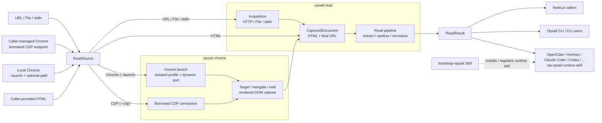

<p align="center">
  
</p>

<h1 align="center">Opsail</h1>

<p align="center"><strong>Native tools that agents can rely on.</strong></p>

<p align="center">
  English | <a href="https://github.com/lencx/opsail/blob/main/README.zh-CN.md">简体中文</a>
</p>

Opsail is a modular native toolkit that gives software agents small, composable, reliable capabilities. Its first capability, `read`, turns static HTML or a DOM rendered by Chrome into readable Markdown, sanitized HTML, or versioned JSON.

The extraction pipeline is deterministic and does not execute page scripts. Acquisition can fetch HTML directly, launch an isolated local Chrome process, or explicitly borrow an existing Chrome DevTools Protocol endpoint. Opsail does not run a CDP adapter server, solve interactive verification, or crawl links; its owned launch mode never reuses a user's Chrome profile.

## Read architecture

Every source becomes the same internal captured document before extraction. `opsail-chrome` owns the browser boundary, with separate paths for an Opsail-owned temporary process and a borrowed caller-managed CDP endpoint. `opsail-read` owns acquisition orchestration, extraction, sanitization, and the result contract. A caller that already has rendered HTML can skip Chrome and provide the HTML plus final URL directly.



Agent hosts such as OpenClaw, Hermes Agent, Claude Code, and Codex persist only the AgentSkills-compatible `opsail` runtime skill. It currently documents `read` and will grow with the CLI while remaining a thin adapter over the same `ReadResult` path. The transient `bootstrap-opsail` Skill installs the binary and registers that runtime Skill; it is not part of the read data path.

<table>
  <thead>
    <tr>
      <th width="180">Crate</th>
      <th width="180">Version</th>
      <th>Description</th>
    </tr>
  </thead>
  <tbody>
    <tr>
      <td width="180"><a href="https://crates.io/crates/opsail"><code>opsail</code></a></td>
      <td width="180"><a href="https://crates.io/crates/opsail"></a></td>
      <td>Agent action CLI and unified command entry point</td>
    </tr>
    <tr>
      <td width="180"><a href="https://crates.io/crates/opsail-chrome"><code>opsail-chrome</code></a></td>
      <td width="180"><a href="https://crates.io/crates/opsail-chrome"></a></td>
      <td>Owns cross-platform Chrome launch, lifecycle, CDP transport, and rendered DOM capture</td>
    </tr>
    <tr>
      <td width="180"><a href="https://crates.io/crates/opsail-read"><code>opsail-read</code></a></td>
      <td width="180"><a href="https://crates.io/crates/opsail-read"></a></td>
      <td>Extracts clean Markdown, sanitized HTML, and structured JSON from static HTML or Chrome-rendered DOM</td>
    </tr>
  </tbody>
</table>

## Installation

### npm

Install the single public Node.js package to get both the ESM API and the `opsail` command. Its exact-version optional dependencies select the native binary for the current platform; the scoped `@opsail/*` packages are implementation details.

```sh
npm install opsail
```

```js
import { read } from "opsail";

const result = await read({
  source: { kind: "url", url: "https://example.com/article" },
});
```

Applications may override binary resolution with `binaryPath` or `OPSAIL_BINARY_PATH`. Electron packagers must unpack `node_modules/@opsail/**/bin/opsail*` from ASAR. See the [Node.js package guide](packages/node/README.md) for the complete embedding contract.

### Agent bootstrap (OpenClaw, Hermes Agent, Claude Code, Codex, and more)

Give your agent this instruction; OpenClaw, Hermes Agent, Claude Code, and Codex have dedicated adapters, and any other AgentSkills-compatible host follows a generic path. `bootstrap-opsail` tracks the `main` branch for Skill content and resolves the exact latest stable release for the CLI. It requests approval before making changes, then reconciles the CLI and the persistent `opsail` runtime Skill independently for the current host. Node.js is optional.

```text
Read and follow https://raw.githubusercontent.com/lencx/opsail/refs/heads/main/skills/bootstrap-opsail/SKILL.md
```

### Prebuilt binaries

On macOS or Linux:

```sh
curl --proto '=https' --proto-redir '=https' --tlsv1.2 -LsSf https://raw.githubusercontent.com/lencx/opsail/refs/heads/main/skills/bootstrap-opsail/scripts/install.sh | sh
```

On Windows, run in PowerShell:

```powershell
irm -UseBasicParsing https://raw.githubusercontent.com/lencx/opsail/refs/heads/main/skills/bootstrap-opsail/scripts/install.ps1 | iex
```

The installer scripts detect the platform, download the latest stable GitHub Release, verify the binary archive's SHA-256 checksum and version, and install to `~/.local/bin`. They do not edit `PATH` by default and print setup guidance when needed. On Windows, set `OPSAIL_UPDATE_PATH=1` before running the installer only when you explicitly want it to update the user `PATH`.

Manual downloads:

- macOS: [Apple Silicon](https://github.com/lencx/opsail/releases/latest/download/opsail-aarch64-apple-darwin.tar.gz) · [Intel](https://github.com/lencx/opsail/releases/latest/download/opsail-x86_64-apple-darwin.tar.gz)
- Linux: [x86_64](https://github.com/lencx/opsail/releases/latest/download/opsail-x86_64-unknown-linux-musl.tar.gz) · [ARM64](https://github.com/lencx/opsail/releases/latest/download/opsail-aarch64-unknown-linux-musl.tar.gz)
- Windows: [x86_64](https://github.com/lencx/opsail/releases/latest/download/opsail-x86_64-pc-windows-msvc.zip)
- [SHA-256 checksums](https://github.com/lencx/opsail/releases/latest/download/SHA256SUMS)

### Cargo

Opsail requires Rust 1.97 or newer when installed from crates.io:

```sh
cargo install opsail
```

Verify the installation:

```sh
opsail --version
```

## Read HTML

Markdown is the default output:

```sh
opsail read https://example.com/article
opsail read ./article.html
opsail read - < article.html
```

Choose another representation, resolve relative links for non-URL input, project one field, or write the result to a file:

```sh
opsail read ./article.html --format html --output cleaned.html
opsail read - --base-url https://example.com/articles/ < article.html
opsail read ./article.html --format json
opsail read ./article.html --property title
opsail read https://example.com/article --user-agent "my-reader/1.0"
```

`extract` is a visible alias for `read`. Run `opsail read --help` for request headers, timeout, byte-limit, and output options.

The default `User-Agent` for direct HTTP acquisition is `opsail/<version>`. Override it when a site returns different static HTML or rejects generic clients. For `mp.weixin.qq.com`, the automatic HTTP mode uses a browser-compatible profile with an `opsail/<version>` product token. An explicit `--user-agent` always wins.

### Read through Chrome

Use Opsail-owned launch when a page needs browser rendering but does not need an existing authenticated browser session. The command shape is `opsail read URL --launch [--chrome-path PATH]`:

```sh
# Discover Chrome, launch it with an isolated temporary profile, and clean it up.
opsail read 'https://example.com/app' --launch --wait-until network-idle

# Select a specific Chrome or Chromium executable.
opsail read 'https://example.com/app' --launch --chrome-path '/path/to/chrome'
```

`--launch` creates an Opsail-owned headless process with a fresh temporary user-data directory, binds remote debugging to loopback on a dynamically allocated port, captures one page, then stops the process and removes the profile. This follows Chrome's current `--headless --remote-debugging-port=0` guidance and its Chrome 136+ requirement that remote debugging use a non-default `--user-data-dir`. It never reuses the user's normal Chrome profile. For reproducible automation, Chrome recommends Chrome for Testing; select its executable with `--chrome-path` or `OPSAIL_CHROME_PATH` (an installed macOS copy is discovered automatically). Executable resolution is consistent on macOS, Linux, and Windows: `--chrome-path` first, then `OPSAIL_CHROME_PATH`, then platform locations and `PATH`. Opsail derives the default launch User-Agent from that Chrome process and changes only its `HeadlessChrome/<version>` product token to `Chrome/<version>`; it does not hard-code a browser version. Opsail does not add `--no-sandbox`; a host that cannot run Chrome with its normal sandbox must change its environment or choose a separately managed browser. See the [Chrome Headless documentation](https://developer.chrome.com/docs/chromium/headless) and [remote-debugging security guidance](https://developer.chrome.com/blog/remote-debugging-port).

Use borrowed CDP when the caller already manages Chrome or explicitly needs an existing browser session. The caller starts Chrome, exposes the remote debugging endpoint, and owns the browser lifecycle. Opsail connects as a short-lived client and does not run an adapter server or background daemon:

```sh
# Navigate an Opsail-owned temporary target inside caller-managed Chrome.
opsail read 'https://example.com/app' --cdp 9222 --wait-until network-idle

# Capture an existing page target without navigating it.
opsail read --cdp 'http://127.0.0.1:9222' --target-id 'TARGET_ID'
```

`--launch` and `--cdp` are mutually exclusive ownership modes. `--cdp` accepts a local port, an HTTP(S) Chrome discovery endpoint, or a browser/page WebSocket URL. `--cdp-direct` is valid only for a page-scoped WebSocket endpoint and cannot be combined with `--target-id`. The default wait state is `load`; available values are `none`, `dom-content-loaded`, `load`, and `network-idle`. `--user-agent` and `--accept-language` are applied before browser navigation. Without an explicit User-Agent, borrowed `--cdp` preserves the caller-managed browser's User-Agent; owned `--launch` uses the browser-derived normalization described above. An explicit value always wins in either mode.

The CDP transport is OS-independent. Browser executable discovery and owned process lifecycle are isolated in `opsail-chrome`, outside the extraction pipeline.

When capturing an existing page through a browser endpoint, Opsail infers the target only if exactly one eligible page is available. If Chrome exposes multiple pages, the command fails safely; pass `--target-id` to select the intended page explicitly. The selected page's final URL must use HTTP(S). Supplying a navigation URL without a target ID instead creates and later closes an Opsail-owned temporary target.

Borrowed CDP grants control over the attached Chrome session and may expose authenticated pages. Connect only to an endpoint the caller explicitly trusts. Opsail never writes the endpoint or its query parameters into `ReadResult`, detaches after capture, and closes only a target it created itself—not borrowed Chrome or a caller-owned target. If capture is abruptly cancelled or the process is terminated, borrowed-target cleanup is best-effort and the caller remains responsible for that browser. Successful owned launch reports `source.kind = "chrome"`; borrowed CDP reports `source.kind = "cdp"`.

### Browser verification detection

Opsail detects high-confidence, full-page browser verification interstitials and returns a `verification-required` error instead of treating them as article content. Detection is evidence-based: it honors the official top-level response contracts for Cloudflare and AWS WAF, and uses strict conjunctions of parsed DOM structure, trusted resource or form URLs, final-page URL constraints, and the absence of a substantive semantic content surface for WeChat, Cloudflare fallback pages, Google `/sorry/`, and top-level DataDome pages. It does not classify a page from generic wording or a single text match.

In owned-Chrome and borrowed-CDP modes, a DOM profile must also be confirmed in the live document. A fixed isolated-world observer measures computed visibility (including ancestor clipping and opacity), viewport intersection, paint ownership with a bounded hit-test grid, and stability across animation frames. Probe selectors are passed as bounded JSON data, never interpolated into executable JavaScript. Evidence is discarded when observation times out or the root frame, loader, or final URL changes; a missing probe cannot turn into a positive classification. Direct HTTP and caller-supplied HTML cannot provide live layout facts, so they use only conservative, versioned structural profiles.

Embedded reCAPTCHA, hCaptcha, Turnstile, HUMAN/PerimeterX, or Arkose widgets and ordinary login pages are not verification interstitials merely because their scripts or elements are present. Providers without an authoritative response contract or provider-owned top-level route require rendered visibility and page-takeover evidence that static markup alone cannot prove, so Opsail deliberately leaves ambiguous pages unclassified. Provider coverage is intentionally conservative and not exhaustive. Opsail surfaces a detected gate; it does not solve a CAPTCHA, perform third-party authentication, or bypass the site's access policy.

For Chrome navigation, `opsail-chrome` exposes privacy-bounded optional main-document response metadata and rendered measurements to `opsail-read`. Response metadata contains the HTTP status and normalized indicators derived only from `cf-mitigated` and `x-amzn-waf-action`; rendered evidence contains booleans and bounded coverage ratios, not DOM text or attributes. Raw header values, cookies, authorization data, arbitrary response headers, and challenge tokens are not retained. Evidence is accepted only when its frame, loader, and response URL match the captured final main document.

### Output contract

Data is written to stdout, or to `--output PATH`. Diagnostics and extraction warnings are written to stderr, so stdout remains safe to pipe. Every successful representation ends with a newline. A downstream closed pipe is treated as a successful termination.

| Exit code | Meaning |
| --- | --- |
| `0` | Successful command, help, or version output |
| `1` | Pre-execution semantic validation, acquisition, extraction, serialization, or write failure |
| `2` | Command-line syntax or usage rejected by the argument parser |

`--format json` emits schema version `1` with these top-level fields:

```text
schemaVersion
content
contentHtml
metadata
source
extraction
quality
warnings
```

`content` is Markdown and `contentHtml` is sanitized HTML. Metadata includes the title and, when available, author, description, site, publication timestamps, image, favicon, language, direction, canonical URL, and domain. Source, extraction, and quality objects record provenance and useful confidence signals.

`--property` accepts:

```text
content, markdown, contentHtml, html, title, author, description, site,
published, modified, image, favicon, language, direction, url, canonicalUrl, domain,
wordCount, quality, source, extraction
```

With `--format json`, a projected property is valid JSON. With Markdown or HTML format, scalar properties are plain text and structured properties are pretty-printed JSON.

### Defaults and limits

- Maximum input: 5 MiB; override with a positive `--max-bytes` value.
- Maximum parsed DOM: 50,000 elements and 256 nesting levels.
- HTTP(S) timeouts: 5 seconds to connect and 15 seconds overall; `--timeout` overrides the overall timeout.
- HTTP requests send `opsail/<version>` as the default User-Agent. WeChat article URLs use the browser-compatible default described above; `--user-agent` overrides either profile and `--accept-language` sets the preferred response language.
- CDP discovery, connection, navigation, waiting, and capture share the same overall timeout and configured input byte limit. Captured CDP HTML also has an absolute 16 MiB ceiling, even when `--max-bytes` is higher.
- Redirect limit: 10.
- URL input and `--base-url` must use HTTP(S) and cannot contain embedded username/password credentials.
- Character decoding considers a BOM, HTTP charset, HTML metadata, UTF-8 validity, then a Windows-1252 fallback.
- A fetched body must look like HTML. If a media type is declared, it must be HTML or a tolerated generic text/binary type.
- File input must be a regular file. Its links remain relative unless `--base-url` is supplied. URL input resolves links against the final response URL.

The byte and DOM limits bound common resource-exhaustion paths; they are not a security sandbox. URL fetching can reach destinations allowed by the host network and honors the system proxy. Treat extracted text and links as untrusted, and enforce network, filesystem, and downstream execution policy in the embedding agent.

## Contributing

Development setup, module boundaries, testing rules, and verification commands are documented in [CONTRIBUTING.md](https://github.com/lencx/opsail/blob/main/CONTRIBUTING.md).

## License

Apache License 2.0
