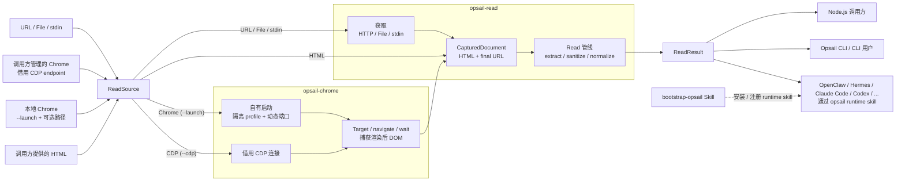

<p align="center">
  
</p>

<h1 align="center">Opsail</h1>

<p align="center"><strong>Native tools that agents can rely on.</strong></p>

<p align="center">
  <a href="https://github.com/lencx/opsail/blob/main/README.md">English</a> | 简体中文
</p>

Opsail 是一套模块化原生工具，为软件 Agent 提供小型、可组合且可靠的行动能力。首个能力 `read` 可将静态 HTML 或 Chrome 所渲染的 DOM 转换为可阅读的 Markdown、清洗后的 HTML 或带版本号的 JSON。

正文提取管线本身不会执行页面脚本。获取阶段既可直接读取 HTML，也可启动隔离的本地 Chrome，或显式借用现有 Chrome DevTools Protocol endpoint。Opsail 不会运行 CDP 适配器服务端、处理交互式验证或抓取链接；其自有启动模式永远不会复用用户的 Chrome profile。

## Read 架构

所有来源都会先转换为同一种内部捕获文档，再进入正文提取。`opsail-chrome` 负责浏览器边界，并区分 Opsail 自有的临时进程与借用调用方管理的 CDP endpoint。`opsail-read` 负责获取编排、正文提取、清洗和结果契约。调用方已经取得渲染后 HTML 时，可以跳过 Chrome，直接提交 HTML 与 final URL。



OpenClaw、Hermes Agent、Claude Code 与 Codex 等宿主只需持久化兼容 AgentSkills 的 `opsail` runtime skill。该 Skill 同时记录 `read` 能力和需要用户明确授权、经过目标校验的 Codex refit 命令，并始终只是原生 CLI 的轻量适配层。临时的 `bootstrap-opsail` Skill 负责安装二进制并注册 runtime Skill，不进入任何运行时数据路径。

<table>
  <thead>
    <tr>
      <th width="180">Crate</th>
      <th width="180">版本</th>
      <th>描述</th>
    </tr>
  </thead>
  <tbody>
    <tr>
      <td width="180"><a href="https://crates.io/crates/opsail"><code>opsail</code></a></td>
      <td width="180"><a href="https://crates.io/crates/opsail"></a></td>
      <td>面向 Agent 行动的 CLI 与统一命令入口</td>
    </tr>
    <tr>
      <td width="180"><a href="https://crates.io/crates/opsail-chrome"><code>opsail-chrome</code></a></td>
      <td width="180"><a href="https://crates.io/crates/opsail-chrome"></a></td>
      <td>负责跨平台 Chrome 启动、生命周期、CDP 传输和渲染后 DOM 捕获</td>
    </tr>
    <tr>
      <td width="180"><a href="https://crates.io/crates/opsail-read"><code>opsail-read</code></a></td>
      <td width="180"><a href="https://crates.io/crates/opsail-read"></a></td>
      <td>从静态 HTML 或 Chrome 渲染后的 DOM 中提取干净的 Markdown、清洗后的 HTML 和结构化 JSON</td>
    </tr>
    <tr>
      <td width="180"><a href="https://crates.io/crates/opsail-refit-codex"><code>opsail-refit-codex</code></a></td>
      <td width="180"><a href="https://crates.io/crates/opsail-refit-codex"></a></td>
      <td>负责经过校验的 Codex renderer refit 生命周期、本机目标安全、额度语义、本地化与 UI payload</td>
    </tr>
  </tbody>
</table>

## Codex 左侧栏额度显示

`opsail-refit-codex` 会在 Codex 左侧栏底部账户行加入一个可逆的剩余额度胶囊。数据只通过 renderer 已有的本机账户 bridge 读取，窗口标签按实际额度时长生成，所有用户文案从内嵌多语言 JSON 加载；不会发起模型调用或外部账户请求。

适配器目前只支持签名 macOS 应用 `/Applications/ChatGPT.app`，且 CDP endpoint 必须绑定到 `127.0.0.1`。注入前会校验 Bundle ID、签名 Team ID、代码签名、进程归属与祖先链、renderer URL 与 shell、侧栏结构以及 bridge 能力。普通 enable 只附加；只有显式 `--launch` 才可通过 Rust 进程 API 启动一次已确认停止的应用。Opsail 永远不会退出、kill、重启、重载、修改或重新签名 ChatGPT。

```sh
opsail refit codex doctor
opsail refit codex enable usage --launch
opsail refit codex enable usage --launch --once
opsail refit codex enable usage
opsail refit codex enable usage --once
opsail refit codex status
opsail refit codex disable usage
```

`--launch` 是无需手工执行应用启动命令的正式入口：它会先尝试附加已有合法 endpoint，仅当 ChatGPT 已确认停止时才启动一次。应用已运行但缺少所选 CDP endpoint 时返回 `restart-required`，端口冲突时返回 `port-unavailable`；任何命令都不会自动退出或重启应用。`doctor`、`status` 与 `disable` 永远不会启动应用。

公开默认端口为 `55321`，可用 `--port PORT` 覆盖；发现和启动始终只使用 `127.0.0.1`。当前实现不会在默认端口被占用时自动选择其他端口。默认的 `persistent`/managed 启用命令会先输出初始报告，再以前台方式保持连接，从而在不增加服务或监听端口的前提下恢复 renderer 重载。`--once` 是 ephemeral 模式：完成当前 document 的校验、注入和健康确认后关闭 CDP 并退出；hard reload、renderer 重建或应用重启后不会恢复。Disable 可先停止经过校验的 Opsail manager 再清理，但绝不会停止 ChatGPT。

启动与手动附加流程、生命周期保证、刷新策略、本地化与 crate API 详见 [Codex refit 指南](crates/opsail-refit-codex/README.md)。

## 安装

### npm

安装唯一的公开 Node.js 包，即可同时获得 ESM API 和 `opsail` 命令。它会通过精确版本的可选依赖为当前平台选择原生二进制；带作用域的 `@opsail/*` 包只是内部实现细节。

```sh
npm install opsail
```

```js
import { read } from "opsail";

const result = await read({
  source: { kind: "url", url: "https://example.com/article" },
});
```

应用可以通过 `binaryPath` 或 `OPSAIL_BINARY_PATH` 覆盖二进制解析。Electron 打包时必须将 `node_modules/@opsail/**/bin/opsail*` 从 ASAR 中解包。完整嵌入约定见 [Node.js 包指南](packages/node/README.md)。

### Agent 引导安装（OpenClaw、Hermes Agent、Claude Code、Codex 等）

把下面这条指令交给你的 agent；OpenClaw、Hermes Agent、Claude Code 与 Codex 有专属适配命令，其他兼容 AgentSkills 的宿主走通用路径。`bootstrap-opsail` 的 Skill 内容跟随 `main` 分支，CLI 则解析为最新稳定 Release 的精确版本；它会在变更前请求授权，再为当前宿主分别核对并安装或更新 CLI 与持久化的 `opsail` runtime Skill。Node.js 不是必需条件。

```text
Read and follow https://raw.githubusercontent.com/lencx/opsail/refs/heads/main/skills/bootstrap-opsail/SKILL.md
```

### 预编译二进制

在 macOS 或 Linux 上运行：

```sh
curl --proto '=https' --proto-redir '=https' --tlsv1.2 -LsSf https://raw.githubusercontent.com/lencx/opsail/refs/heads/main/skills/bootstrap-opsail/scripts/install.sh | sh
```

在 Windows 上，使用 PowerShell 运行：

```powershell
irm -UseBasicParsing https://raw.githubusercontent.com/lencx/opsail/refs/heads/main/skills/bootstrap-opsail/scripts/install.ps1 | iex
```

安装脚本会自动识别平台、下载最新稳定的 GitHub Release、验证二进制归档的 SHA-256 校验和与版本，并安装到 `~/.local/bin`。默认不会修改 `PATH`，需要时会输出配置提示。在 Windows 上，只有明确希望安装器更新用户 `PATH` 时，才在运行前设置 `OPSAIL_UPDATE_PATH=1`。

手动下载：

- macOS：[Apple Silicon](https://github.com/lencx/opsail/releases/latest/download/opsail-aarch64-apple-darwin.tar.gz) · [Intel](https://github.com/lencx/opsail/releases/latest/download/opsail-x86_64-apple-darwin.tar.gz)
- Linux：[x86_64](https://github.com/lencx/opsail/releases/latest/download/opsail-x86_64-unknown-linux-musl.tar.gz) · [ARM64](https://github.com/lencx/opsail/releases/latest/download/opsail-aarch64-unknown-linux-musl.tar.gz)
- Windows：[x86_64](https://github.com/lencx/opsail/releases/latest/download/opsail-x86_64-pc-windows-msvc.zip)
- [SHA-256 校验文件](https://github.com/lencx/opsail/releases/latest/download/SHA256SUMS)

### Cargo

通过 crates.io 安装时，Opsail 需要 Rust 1.97 或更高版本：

```sh
cargo install opsail
```

验证安装：

```sh
opsail --version
```

## 读取 HTML

默认输出 Markdown：

```sh
opsail read https://example.com/article
opsail read ./article.html
opsail read - < article.html
```

可以选择其他输出形式、为非 URL 输入解析相对链接、投影单个字段，或将结果写入文件：

```sh
opsail read ./article.html --format html --output cleaned.html
opsail read - --base-url https://example.com/articles/ < article.html
opsail read ./article.html --format json
opsail read ./article.html --property title
opsail read https://example.com/article --user-agent "my-reader/1.0"
```

`extract` 是 `read` 的可见别名。运行 `opsail read --help` 可查看请求头、超时、字节限制和输出选项。

直接 HTTP 获取的默认 `User-Agent` 为 `opsail/<version>`。当站点针对不同客户端返回不同静态 HTML，或拒绝通用客户端时，可以覆盖它。对于 `mp.weixin.qq.com`，自动 HTTP 模式会使用带 `opsail/<version>` 产品标识的浏览器兼容配置；显式 `--user-agent` 始终优先。

### 通过 Chrome 读取

页面需要浏览器渲染、但不依赖现有登录会话时，使用 Opsail 自有启动模式。命令形式为 `opsail read URL --launch [--chrome-path PATH]`：

```sh
# 自动查找 Chrome，使用隔离的临时 profile 启动，并在完成后清理。
opsail read 'https://example.com/app' --launch --wait-until network-idle

# 指定 Chrome 或 Chromium 可执行文件。
opsail read 'https://example.com/app' --launch --chrome-path '/path/to/chrome'
```

`--launch` 会启动 Opsail 自有的 headless 进程，使用全新的临时 user-data 目录，将远程调试绑定到 loopback 上的动态端口，捕获一个页面后停止进程并移除 profile。这符合 Chrome 当前的 `--headless --remote-debugging-port=0` 建议，以及 Chrome 136+ 要求远程调试必须使用非默认 `--user-data-dir` 的安全约束。它不会复用用户日常使用的 Chrome profile。Chrome 建议在可复现的自动化环境中使用 Chrome for Testing；可以通过 `--chrome-path` 或 `OPSAIL_CHROME_PATH` 指定其可执行文件（macOS 已安装版本可被自动发现）。macOS、Linux 与 Windows 使用相同的可执行文件解析顺序：先检查 `--chrome-path`，再检查 `OPSAIL_CHROME_PATH`，最后检查平台标准位置与 `PATH`。Opsail 会从该 Chrome 进程动态取得自有启动模式的默认 User-Agent，并且只将其中的 `HeadlessChrome/<version>` 产品标识替换为 `Chrome/<version>`，不会硬编码浏览器版本。Opsail 不会自动添加 `--no-sandbox`；若宿主环境无法使用 Chrome 的正常 sandbox，应调整环境或改用单独管理的浏览器。参见 [Chrome Headless 文档](https://developer.chrome.com/docs/chromium/headless)与[远程调试安全说明](https://developer.chrome.com/blog/remote-debugging-port?hl=zh-cn)。

调用方已经管理 Chrome，或明确需要现有浏览器会话时，使用借用 CDP 模式。调用方负责启动 Chrome、暴露远程调试 endpoint 并管理浏览器生命周期。Opsail 只是短生命周期 client，不会运行适配器服务端或后台 daemon：

```sh
# 在调用方管理的 Chrome 中创建临时 target、导航并捕获。
opsail read 'https://example.com/app' --cdp 9222 --wait-until network-idle

# 不导航，直接捕获现有页面 target。
opsail read --cdp 'http://127.0.0.1:9222' --target-id 'TARGET_ID'
```

`--launch` 与 `--cdp` 是互斥的所有权模式。`--cdp` 接受本地端口、HTTP(S) Chrome discovery endpoint，或 browser/page WebSocket URL。`--cdp-direct` 只能用于 page-scoped WebSocket endpoint，且不能与 `--target-id` 组合。默认等待 `load`；可选值为 `none`、`dom-content-loaded`、`load` 和 `network-idle`。`--user-agent` 与 `--accept-language` 会在浏览器导航前应用；未显式设置 User-Agent 时，借用的 `--cdp` 会保留调用方所管理浏览器的 User-Agent，自有 `--launch` 则使用上文所述的浏览器派生规范化值。显式设置的值在两种模式下都始终优先。

CDP 传输层与操作系统无关。浏览器可执行文件查找与自有进程生命周期被隔离在 `opsail-chrome` 中，不进入正文提取管线。

通过 browser endpoint 捕获现有页面时，只有在恰好存在一个符合条件的 page 时，Opsail 才会自动确定 target。若 Chrome 暴露了多个页面，命令会安全失败；必须通过 `--target-id` 明确选择目标页面。所选页面的 final URL 必须使用 HTTP(S)。若提供导航 URL 但不提供 target ID，Opsail 则会创建并在完成后关闭自己拥有的临时 target。

借用 CDP 可以控制所连接的 Chrome 会话，也可能访问已登录页面。只连接调用方明确信任的 endpoint。Opsail 不会把 endpoint 或其中的查询参数写入 `ReadResult`；捕获后会 detach，并且只关闭自己创建的 target，不会关闭借用的 Chrome 或调用方已有的 target。若捕获被突然取消或进程被终止，借用 target 的清理只能 best-effort，调用方仍需负责该浏览器。自有启动成功时报告 `source.kind = "chrome"`；借用 CDP 则报告 `source.kind = "cdp"`。

### 浏览器验证检测

Opsail 会检测高置信度的整页浏览器验证中间页，并返回 `verification-required` 错误，而不是把它当成文章内容。检测采用结构化证据：Cloudflare 与 AWS WAF 使用其官方定义的顶层响应契约；微信、Cloudflare DOM 回退页、Google `/sorry/` 与顶层 DataDome 页面则要求解析后的 DOM 结构、可信的资源或表单 URL、最终页面 URL 限制以及“无实质语义内容区域”等多项条件同时成立。它不会仅凭通用文案或一次文本匹配判定。

在自有 Chrome 与借用 CDP 模式中，DOM profile 还必须由实时文档确认。固定的 isolated-world observer 会测量计算后的可见性（包括祖先裁剪与累计透明度）、viewport 交集、有限命中网格上的前景绘制占用，以及跨动画帧的稳定性。CSS selector 只作为有界 JSON 数据传入，不会拼接进可执行 JavaScript。如果探测超时，或根 frame、loader、最终 URL 在探测期间发生变化，这份证据会被丢弃；缺失证据绝不会升级成正向判定。直接 HTTP 与调用方提供的 HTML 没有实时布局信息，因此只使用保守且带版本约束的结构 profile。

页面仅仅嵌入 reCAPTCHA、hCaptcha、Turnstile、HUMAN/PerimeterX 或 Arkose widget，或者只是普通登录页，并不会被视为整页验证中间页。对于既没有权威响应契约、也不是提供方自有顶层路由的服务，必须取得渲染后的可见性和页面接管证据；静态 HTML 无法证明时，Opsail 会保守地保持未分类。当前厂商覆盖并非穷尽所有服务。Opsail 只负责识别并暴露验证状态，不会破解 CAPTCHA、代办第三方认证或绕过站点访问策略。

对于 Chrome 导航，`opsail-chrome` 只向 `opsail-read` 暴露经过隐私边界约束的可选主文档响应元数据与渲染测量。响应元数据包含 HTTP 状态码，以及仅由 `cf-mitigated` 和 `x-amzn-waf-action` 推导出的规范化指示；渲染证据只包含布尔值和有界覆盖率，不包含 DOM 文本或属性。原始 header 值、Cookie、认证数据、任意其他响应 header 和 challenge token 都不会被保留；只有 frame、loader 与响应 URL 同捕获到的最终主文档一致时，证据才会被采用。

### 输出契约

数据写入 stdout，或写入 `--output PATH` 指定的文件。诊断和提取警告写入 stderr，因此 stdout 可以安全地通过管道传递。每个成功结果都以换行符结尾；下游提前关闭管道会被视为正常结束。

| 退出码 | 含义 |
| --- | --- |
| `0` | 命令成功，或成功输出帮助/版本信息 |
| `1` | 运行前语义校验、获取、提取、序列化或写入失败 |
| `2` | 参数解析器拒绝的命令行语法或用法错误 |

`--format json` 输出 schema 版本 `1`，包含以下顶层字段：

```text
schemaVersion
content
contentHtml
metadata
source
extraction
quality
warnings
```

`content` 是 Markdown，`contentHtml` 是清洗后的 HTML。元数据包含标题，以及可用时的作者、描述、站点、发布时间、图片、图标、语言、文字方向、规范 URL 和域名。`source`、`extraction` 和 `quality` 对象记录来源、提取过程和质量信号。

`--property` 接受：

```text
content, markdown, contentHtml, html, title, author, description, site,
published, modified, image, favicon, language, direction, url, canonicalUrl, domain,
wordCount, quality, source, extraction
```

使用 `--format json` 时，投影字段输出合法 JSON；使用 Markdown 或 HTML 格式时，标量字段输出纯文本，结构化字段输出格式化 JSON。

### 默认值与限制

- 最大输入为 5 MiB，可通过正数 `--max-bytes` 覆盖。
- 解析后的 DOM 最多包含 50,000 个元素，嵌套深度最多为 256 层。
- HTTP(S) 连接超时为 5 秒，总超时为 15 秒；`--timeout` 可覆盖总超时。
- HTTP 请求默认发送 `opsail/<version>` User-Agent；微信文章 URL 使用上文所述的浏览器兼容默认值。`--user-agent` 可覆盖任一配置，`--accept-language` 可指定偏好的响应语言。
- CDP discovery、连接、导航、等待和捕获共用同一个总超时与配置的输入字节限制。即使 `--max-bytes` 设置得更高，CDP 捕获的 HTML 仍有 16 MiB 的绝对上限。
- 最多跟随 10 次重定向。
- URL 输入和 `--base-url` 必须使用 HTTP(S)，且不能包含用户名/密码凭据。
- 字符解码依次考虑 BOM、HTTP charset、HTML 元数据、UTF-8 有效性，最后回退到 Windows-1252。
- 获取的响应体必须表现为 HTML；如果声明了媒体类型，则必须是 HTML 或允许的通用文本/二进制类型。
- 文件输入必须是普通文件。除非提供 `--base-url`，文件中的链接会保持相对形式；URL 输入则以重定向后的最终 URL 解析链接。

字节和 DOM 限制可约束常见的资源耗尽路径，但它们不是安全沙箱。URL 获取能够访问宿主网络允许的目标，并遵循系统代理设置。提取出的文本和链接都应视为不可信数据；嵌入 Agent 时，应另行实施网络、文件系统和下游执行策略。

## 参与贡献

开发环境、模块边界、测试规则与验证命令见 [CONTRIBUTING.zh-CN.md](https://github.com/lencx/opsail/blob/main/CONTRIBUTING.zh-CN.md)。

## 许可证

Apache License 2.0
