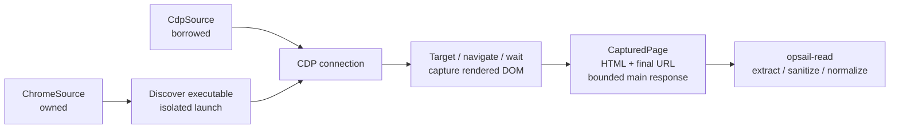

# opsail-chrome

`opsail-chrome` owns Opsail's Chrome-specific boundary: cross-platform local
executable discovery and launch, caller-managed CDP connections, target
lifecycle, navigation waits, and rendered DOM capture.



The crate supports two explicit ownership modes:

- `capture_cdp` borrows a caller-managed Chrome endpoint and never closes the
  browser or a caller-owned target.
- `capture_chrome` discovers or uses an explicitly configured executable,
  launches an isolated temporary Chrome profile, captures one page, and stops
  only that owned process.

Both modes return a `CapturedPage` containing HTML, the final URL, and optional
privacy-bounded top-level response metadata. Content extraction, sanitization,
verification classification, and `ReadResult` belong to `opsail-read`, not this
crate.

## Rust API

```toml
[dependencies]
opsail-chrome = "0.1"
tokio = { version = "1", features = ["macros", "rt-multi-thread"] }
```

```rust
use opsail_chrome::{
    CaptureOptions, CdpSource, ChromeSource, capture_cdp, capture_chrome,
};

#[tokio::main]
async fn main() -> Result<(), Box<dyn std::error::Error>> {
    let options = CaptureOptions::default();

    let owned_source = ChromeSource::new("https://example.com/app".parse()?);
    let owned_page = capture_chrome(&owned_source, &options).await?;
    println!("{}", owned_page.final_url);

    let mut borrowed_source = CdpSource::new("http://127.0.0.1:9222");
    borrowed_source.url = Some("https://example.com/app".parse()?);
    let borrowed_page = capture_cdp(&borrowed_source, &options).await?;
    println!("{}", borrowed_page.final_url);

    Ok(())
}
```

## Owned local launch

`capture_chrome(&ChromeSource, &CaptureOptions)` uses Chrome's
`--remote-debugging-port=0` and reads the generated `DevToolsActivePort` file,
so no fixed port or macOS-only executable path is embedded in the protocol. It
starts headless Chrome with a fresh temporary `--user-data-dir`, captures one
page, requests browser shutdown, terminates the process if needed, and removes
the temporary profile.

The launch contract follows Chrome's current automation guidance:

```text
chrome --headless \
  --remote-debugging-address=127.0.0.1 \
  --remote-debugging-port=0 \
  --user-data-dir=<fresh-temporary-directory> \
  about:blank
```

- [`--headless`](https://developer.chrome.com/docs/chromium/headless) selects
  Chrome's unified headless implementation. A zero debugging port lets Chrome
  allocate a collision-free port.
- [Chrome 136 and later](https://developer.chrome.com/blog/remote-debugging-port)
  require remote-debugging switches to use a non-default data directory.
  Opsail always creates a fresh profile and never weakens this requirement.
- Chrome recommends Chrome for Testing for reproducible browser automation. An
  installed macOS Chrome for Testing is preferred during discovery; on every
  platform it can be selected explicitly with `ChromeSource::executable_path`,
  `--chrome-path`, or `OPSAIL_CHROME_PATH`.

The loopback address is explicit rather than relying on a browser default.
Opsail consumes the endpoint from the isolated profile instead of parsing
human-readable process output.

Executable resolution is deterministic on macOS, Linux, and Windows:

1. `ChromeSource::executable_path` (the CLI's `--chrome-path` value).
2. `OPSAIL_CHROME_PATH`.
3. Supported platform locations, then executable names found through `PATH`.

Owned launch never points at or copies the user's normal Chrome profile, so it
does not inherit that profile's cookies or authenticated sessions. It also does
not add `--no-sandbox`; sandbox policy remains an explicit responsibility of
the host environment.

When `CaptureOptions::user_agent` is `None`, owned launch asks that Chrome
process for its actual User-Agent and changes only the
`HeadlessChrome/<version>` product token to `Chrome/<version>`. The browser
version and every other product token remain browser-derived. An explicit
User-Agent is applied unchanged and always takes precedence.

## Borrowed CDP

`capture_cdp(&CdpSource, &CaptureOptions)` accepts a local port, an HTTP(S)
discovery endpoint, or a browser/page WebSocket URL. It never closes the
caller-managed browser or a caller-owned target. A target created by Opsail for
one navigation is closed during normal completion and cleanup is attempted on
bounded failures. If the capture future is abruptly cancelled or the process
is terminated, detaching and target cleanup are best-effort; the borrowed
browser remains the caller's responsibility.

Treat a borrowed endpoint as high-trust configuration because it may expose
authenticated pages. Endpoint URLs and query parameters must not be included
in captured results or public diagnostics.

Borrowed CDP preserves the caller-managed browser's User-Agent when
`CaptureOptions::user_agent` is `None`. An explicit value is applied unchanged
before navigation. This differs intentionally from the owned-launch policy:
Opsail does not rewrite the identity of a browser it does not own.

## Main-document response metadata

When Opsail performs a navigation, `CapturedPage::response()` may expose a
`CapturedResponse` for the top-level document. It contains the HTTP status and
normalized indicators derived from an allowlist of only two case-insensitive
headers: `cf-mitigated` and `x-amzn-waf-action`. Raw header values are not
retained. These provider-declared signals let `opsail-read` classify Cloudflare
and AWS WAF verification without relying on page text.

The response is optional because an existing target may not have navigated
through this capture, and a CDP endpoint may not expose the necessary Network
events. Evidence is associated only when its frame, loader, and response URL
match the captured final main document. Cookies, authorization data, raw
allowlisted values, and arbitrary headers are never retained in `CapturedPage`.
`opsail-chrome` captures this bounded evidence but does not decide whether a
page is usable content or attempt to solve a verification challenge.

## Rendered page evidence

`capture_cdp_with_probes` and `capture_chrome_with_probes` accept at most 16
bounded CSS selectors. Selectors are encoded as `Runtime.callFunctionOn`
arguments to a fixed function in an isolated world; they are never executable
source. `CapturedPage::rendered_evidence()` exposes only match counts,
visibility and stability booleans, and viewport/paint-hit coverage ratios.
It does not expose text, attributes, rectangles, screenshots, or raw selectors.

The observer accounts for computed ancestor visibility, clipping, opacity,
viewport intersection, and frontmost paint ownership on a fixed 5 by 5 grid.
The root frame, loader, and final URL are read before and after observation. A
navigation race, unsupported CDP command, invalid result, or observation timeout
removes the rendered evidence without failing an otherwise valid HTML capture.
Provider identity and verification policy remain the responsibility of
`opsail-read`.

## License

Apache-2.0
